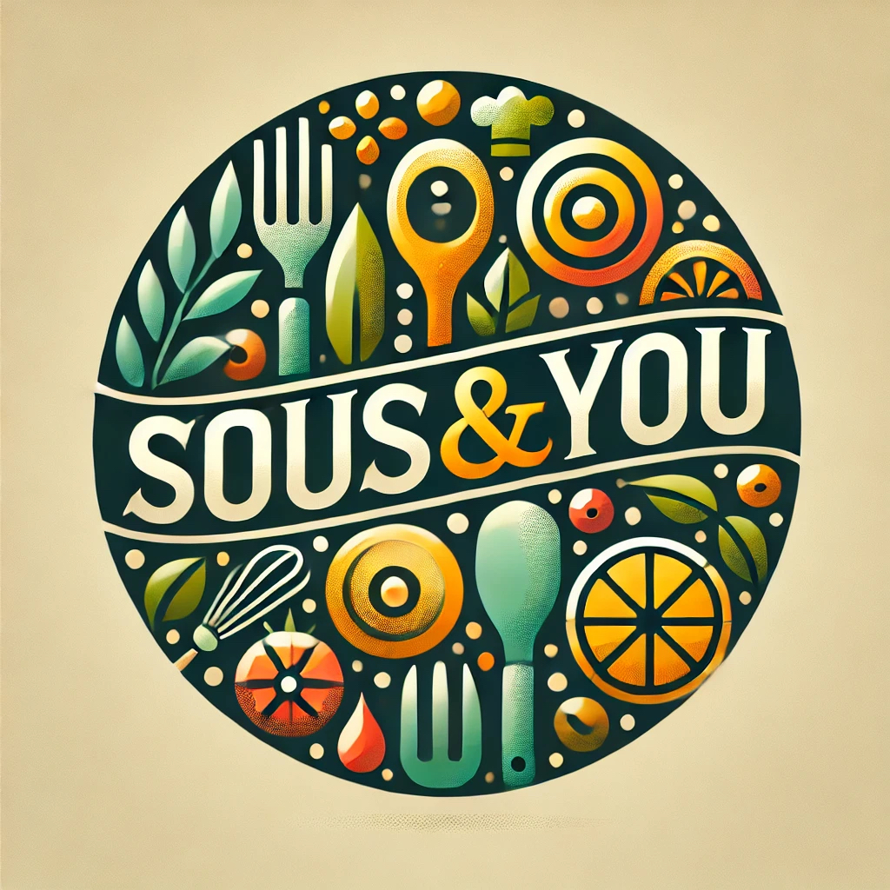

<p align="center">
  
</p>

<h1 align="center">Sous & You</h1>
<p align="center">AI-powered recipe assistant — solving "What should I cook?"</p>

<p align="center">
  
  
  
  
</p>

---

## Overview

**Sous & You** is a conversational AI chatbot that recommends personalized recipes based on your time, dietary restrictions, skill level, available ingredients, and budget.

**How it works:**
```
User Query → Flask API → AI Search → Personalized Recipes → Chat Response
```

---

## Quick Start
```bash
# 1. Clone & setup
git clone https://github.com/CSCI-577A/SousAndYou.git
cd SousAndYou

# 2. Start Redis
docker run --name redis -p 6379:6379 -d redis

# 3. Run backend (localhost:5000)
cd backend && pip install -r requirements.txt && python3 flask_api.py

# 4. Run frontend (localhost:4200)
cd frontend && npm install && ng serve
```

---

## Project Structure
```
├── frontend/          # Angular 17 app
│   └── src/app/
│       ├── pages/     # home (chat), about (team)
│       └── shared/    # navbar
├── backend/           # Flask API + Redis
└── .github/workflows/ # CI/CD
```

---

## Tech Stack

**Frontend:** Angular 17 · TypeScript · RxJS  
**Backend:** Python · Flask · Redis  
**Cloud:** AWS (EC2, S3)  
**CI/CD:** GitHub Actions

---

## Team

| Name | Role |
|------|------|
| Alex Hunter | Backend |
| Ankita Khatri | Frontend & Deployment |
| April Dawoud | Frontend |
| Benson Li | Backend & Deployment |
| Charlotte Hausman | PM & Scrum Master |
| Emily Koch | Database |
| Mahati Malladi | Database & QA |
| Paris Acosta | Backend & Database |
| Shweta Sankaranarayanan | Frontend & QA |

---

<p align="center"><sub>USC CSCI-577A · Spring 2025</sub></p>
